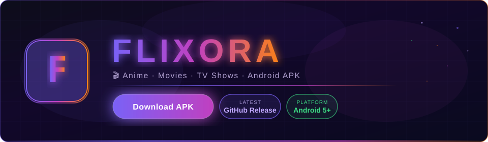
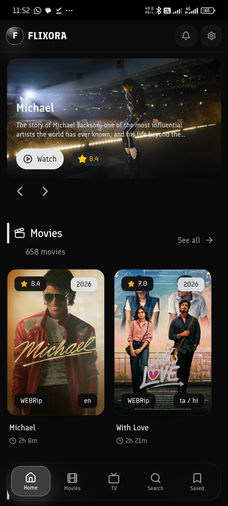
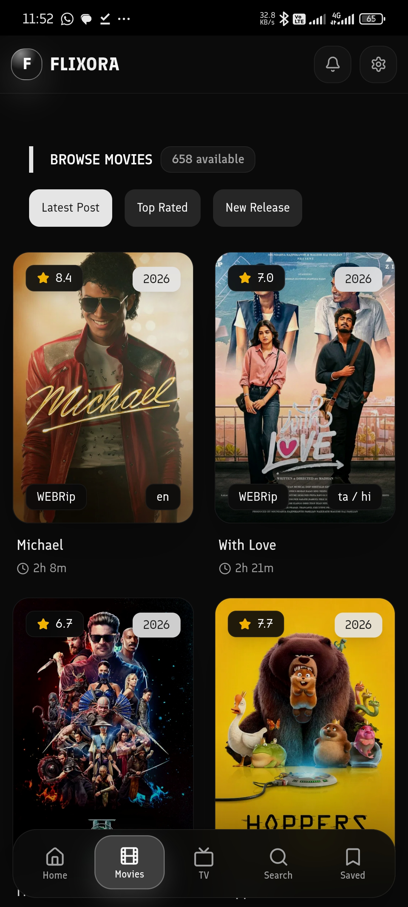
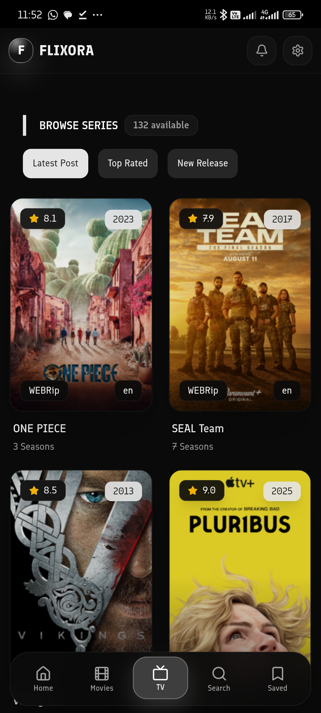
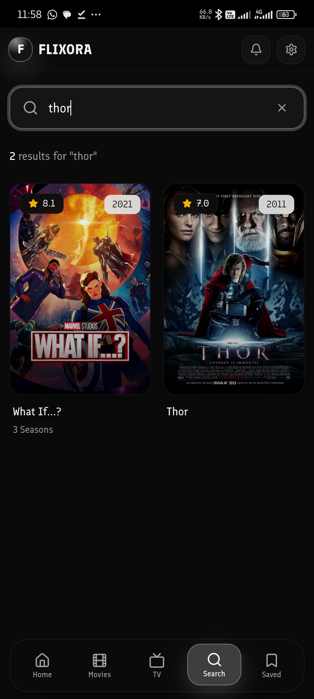
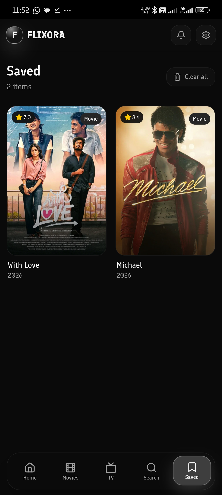
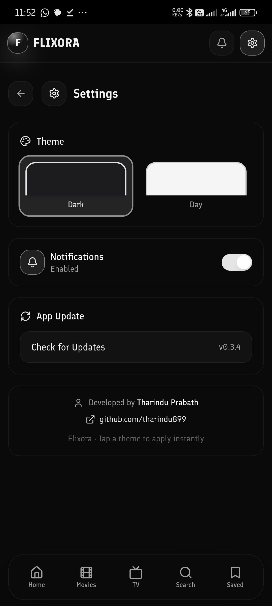

  

  

> 🌟 **Flixora** is a polished Android app for browsing and watching anime, movies, and TV shows — built with React + Vite and packaged as a native APK via Capacitor.

---

## 📸 Screenshots

| Home | Movies | TV Shows |
|:---:|:---:|:---:|
|  |  |  |
| **Search** | **Saved** | **Settings** |
|  |  |  |

---

## 📥 How to Install

1. Tap the **Download APK** button above or go to [**Releases**](../../releases/latest) and grab the latest `.apk` file.
2. Open the downloaded APK on your Android device.
3. If prompted, allow **Install from unknown sources** for your browser or file manager.
4. Tap **Install** and launch **Flixora**.

> ⚠️ Because this APK is distributed outside the Play Store, Android will ask you to allow installation from unknown sources. This is normal for sideloaded apps.

---

## 📱 What's Inside

| Feature | Details |
|---|---|
| 🏠 **Home** | Hero banner, latest movies, latest TV shows, seasons, new episodes, top charts |
| 🎬 **Movies** | Full movie catalogue with quality details and download links |
| 📺 **TV Shows** | Series browser with season and episode navigation |
| 🆕 **New Episodes** | Episode list with total episode counts |
| 🏆 **Top Charts** | Top Movies and Top TV Shows side by side |
| ▶️ **Watch Page** | Abyss player, direct player, Telegram links, VLC, MX, MX Pro buttons |
| 💬 **Subtitles** | Manual subtitle sync, duplicate protection, Abyss CC helper |
| 🔔 **Notifications** | In-app update notifications |
| 🔖 **Saved** | Bookmark movies and shows locally on your device |
| 🔍 **Search** | Search movies, shows, cast, and more |
| 🎨 **Theme** | Dark and light mode support |
| 🔄 **Auto-update** | In-app update checker — notifies you when a new APK is available |

---

## 🔄 In-App Updates

Flixora checks for new releases automatically. When a newer APK is available:

- A bottom-sheet notification appears on launch.
- You can also check manually from **Settings → Check for Update**.
- On Android, tapping **Download & Install** downloads the new APK natively and opens the system installer — no browser needed.

---

## ▶️ Player Buttons

The Watch page gives you multiple ways to play content:

| Button | What it does |
|---|---|
| **Abyss** | Opens the built-in Abyss player |
| **Reload** | Reloads the Abyss player iframe |
| **Sync Subs** | Manually syncs subtitles to the player |
| **Direct** | Opens a direct video player |
| **Android** | Opens via Android system intent |
| **VLC** | Opens in VLC |
| **MX** | Opens in MX Player |
| **MX Pro** | Opens in MX Player Pro |

---

## 💬 Subtitle Notes

- Subtitles sync **manually** using the **Sync Subs** button to avoid interrupting playback.
- Duplicate subtitle uploads are blocked automatically.
- Both `.srt` and `.vtt` formats are supported.
- A helper message appears if Abyss CC needs a player reload.

---

## 🔐 Permissions

Flixora requests only what it needs:

| Permission | Why |
|---|---|
| `INTERNET` | Browse and stream content |
| `REQUEST_INSTALL_PACKAGES` | Install downloaded APK updates |
| `WRITE_EXTERNAL_STORAGE` | APK download on Android 9 and below only |

---

## 🧩 Tech Stack

Built with:

- **React 19** + **Vite 6** — fast, modern frontend
- **Capacitor 6** — native Android bridge
- **TailwindCSS 4** + **Radix UI** — polished mobile UI
- **Framer Motion** — smooth animations
- **Plyr** — video player support
- **GitHub Actions** — automated signed APK builds and releases

---

## 📋 Requirements

- Android **5.0 (Lollipop)** or higher
- ~30 MB free storage for the APK
- Internet connection for streaming

---

## 🚀 Release Notes

Each release includes auto-generated notes with:

- 🧾 Release summary
- ✨ New features
- 🐞 Bug fixes
- 📝 Changelog

See the full history in [**Releases**](../../releases).

---

## 👤 Developer

Built by **[Tharindu Prabath](https://github.com/tharindu899)** — private project, not affiliated with any streaming service.

---

### 🎬 Built for anime fans &nbsp;•&nbsp; 📱 Packed for Android &nbsp;•&nbsp; 🚀 Released by GitHub Actions

